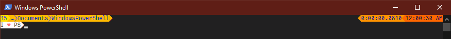
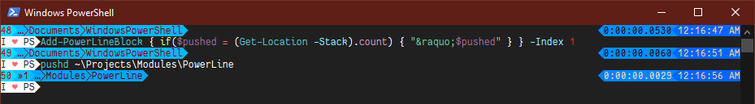

## PowerLine - Beautiful, Powerfull, PowerShell prompts

### Install

> **NOTE:**
> If you don't have my [`PANSIES` module for ANSI Escape Sequences](/PoshCode/Pansies), you may want to install that separately, because it includes a (fully backwards compatible) replacement for `Write-Host`, which requires the `-AllowClobber` switch to install:
>
> ```posh
> Install-Module PANSIES -AllowClobber
> ```

You can install and import PowerLine from the PowerShell Gallery:

```posh
Install-Module PowerLine
Import-Module PowerLine
```
### First use configuration

There are quite a few options for PowerLine, and you're going to want to set some of them immediately to take full advantage.

```posh
Set-PowerLinePrompt -SetCurrentDirectory -RestoreVirtualTerminal -Newline -Timestamp -Colors "#FFDD00", "#FF6600"
```


You can change the colors by running just that part of the command:

```Posh
Set-PowerLinePrompt -Colors "#00DDFF", "#0066FF"
```


You can review (or modify) your current blocks by using `$prompt`, and check which colors it's using with `$prompt.colors`, but there are also commands like the one above to help out.

Now you can add additional blocks to your prompt, even inserting them into the list. Blocks without output are automatically hidden in PowerLine, so you can write a conditional block like this:

```posh
Add-PowerLineBlock { if($pushed = (Get-Location -Stack).count) { "&raquo;$pushed" } }  -Index 1
```




Note that in your PowerLine blocks, there is full support for [PANSIES](/PoshCode/PANSIES) `Text`, which means named HTML Entities like `&hearts;` and `&euro;` and colors from it's drives, like `$fg:red` etc.

There are some helper functions in PowerLine for common things you'd want in your prompt, like `Get-ShortenedPath` or `Get-Elapsed` and `Test-Elevation` and `Test-Success`.

Once you start playing with the [other options](#configuration), and get it the way you want, you can save it, and Powerline will re-load it on import in the future:

```posh
Export-PowerlinePrompt
```

For more information about the [configuration](#configuration) --particularly how to get the cool angled separators you see in my screenshots using [powerline fonts](#powerline-fonts-and-separators)-- you can skip past this explanation of why I wrote the module, but you should also explore the commands, as the documentation is currently lagging behind the implementation.

# Why Powerline?

```gherkin
As a PowerShell user
In order to have the right information available
I need to be able to customize my prompt

As a PowerShell module author
In order to give my users the right information
I need to add information to the user's prompt

As an alpha geek
In order to stand out
I want to have a cool prompt!
```

> Currently in PowerShell, the prompt is a function that _must_ return a string. Modules that want to add information to your prompt typically _don't even try_ if you have customized your prompt (see Posh-Git, for example). The goal of PowerLine is to have beautiful custom prompts **and** let modules add (and remove) information easily.

## Your Prompt as a Collection

The core principle of PowerLine 3 is to make your prompt easier to change, and changes easier to undo.

The idea is to assume a `$Prompt` variable that's a `List` of `ScriptBlock` and just join the output of those scriptblocks:

```posh
function prompt {
    -join $prompt.Invoke()
}
```

## Why Lists of ScriptBlocks?

1. The user can easily add or remove information on the fly.
2. Modules can add (and remove) information as they're imported/removed.
3. We can customize the look separate from the content.

Take this for example, it's the same as the current default prompt, except split in three parts:

```
[System.Collections.Generic.List[ScriptBlock]]$Prompt = @(
    { "PS " }
    { $executionContext.SessionState.Path.CurrentLocation }
    { '>' * ($nestedPromptLevel + 1) }
)
```

This would produce _the same output_ as before, and would have _no impact_ on users who already overwrite the default prompt. In fact, **you** can switch to this right now, by just putting those two blocks in your profile.


### For users:

It's suddenly easy to tweak the prompt. I can remove the unecessary "PS " from the front of my prompt by just running

```posh
$Prompt = $Prompt | Select -Skip 1
```

Or if I wanted to print the current command's `HistoryId` instead of the "PS", I could just replace that first part:

```posh
$Prompt[0] = { "$($MyInvocation.HistoryId) " }
```

### For module authors:

Modules can modify the prompt just as easily. Adding to a list is simpler and easier to undo, plus it's possible for the user to re-order their prompt. Since modules don't have to modify or wrap the actual prompt function, users end up in control.

For example, posh-git can add it's information to the prompt in just one line:

```posh
$Prompt.Add({Write-VcsStatus})
```

And can hook it's own removal to clean up the status:

```posh
$MyInvocation.MyCommand.Module.OnRemove = {
    $Prompt.RemoveAll( {param($_) $_.ToString().Trim() -eq "Write-VcsStatus" } )
}
```

#### Using PowerLine

Of course, with PowerLine, it's even easier. A module can just run:

```posh
Add-PowerLineBlock { Write-VcsStatus } -AutoRemove
```

## Configuration

PowerLine has a lot of flexibility and functionality around output and looks. Because your whole prompt is just a list of script blocks, we can transform your prompt's appearance. You can go from simple to elegant instantly, and then take control of colors and more.

### PowerLine Coloring blocks

The `-Colors` parameter supports setting the background colors. You can pass a list of colors and PowerLine will loop through them.
You can also specify two colors, and PowerLine will generate a gradient between those colors with the same number of steps as you have output blocks.

Basically, each scriptblock which has output (PowerLine cleans up and ignores empty blocks), uses one of those colors, looping back to the first if it runs out.
PowerLine automatically selects contrasting colors for the text (foreground) color.

You can set the color with something like this: `Set-PowerLinePrompt -Color "#00DDFF","#0066FF"`

### PowerLine Fonts and Separators

The `-PowerLineFont` switch requires using a [PowerLine font](https://github.com/PowerLine/fonts), which is a font that
has the extra extended characters with the nice angled separators you see in the screenshots here between colors.
There are a lot of monospaced fonts to choose from, and you can even install them all by just cloning the repository
and running the `install.ps1` script, or you can just pick just one TTF and download and install that.

There are [screenshots of all of them here](https://github.com/powerline/fonts/blob/master/samples/All.md).

If you're not using a PowerLine font, don't use the `-PowerLineFont` switch, and the module will output common ASCII
box characters like ▌ as the separators...

These characters are set into a dictionary (`[PoshCode.Pansies.Entities]::ExtendedCharacters`) when you call `Set-PowerLinePrompt`.

### Prompts as arrays

By default, each ScriptBlock outputs one string, and is colored in one color, with the "ColorSeparator" character between each block.

However, PowerLine also supports blocks which output arrays. When a ScriptBlock outputs an array of strings,
they will be separated with the alternate "Separator" instead of the "ColorSeparator".

All you need to to is start adding things to your `$Prompt` -- you can do that directly on the list, using `$Prompt.Add` or `$Prompt.Insert`, or you can use the `Add-PowerLine` command.

#### Right-aligned blocks

If you add a scriptblock that outputs _just_ a tab `{ "``t" }`,
blocks after that will be right-aligned until the next block which is _just_ a newline `{ "``n" }`.

For Right-aligned blocks, the "ReverseColorSeparator" or "ReverseSeparator" characters are used instead of the "ColorSeparator" and "Separator".

#### Characters and Custom Entities

PowerLine uses the [Pansies](https://github.com/PoshCode/Pansies) module for coloring and output, so it inherits Pansies' support for [HTML named entities](https://www.w3schools.com/charsets/ref_html_entities_4.asp) like `&hearts;` and `&copy;` or `&cent;` and numerical unicode character entities in decimal (`&#926;`) and hexadeximal (`&#x39E;`), so you can easily embed characters.

Additionally, Pansies treats the `ExtendedCharacters` dictionary of characters mentioned earlier as entities, and has an additional `EscapeSequences` dictionary which maps entity names to a string. Both of these are modifyable and support adding your own characters, which can then be used as named entities with a `&` and a `;` ...

### Helper Functions for Prompts

We recommend that modules which want to add information to the prompt create a function which returns a string, and then add a scriptblock wrapping that single function to the `$Prompt` using `Add-PowerLineBlock` (or by hand, as shown above).

There are a few extra functions included as part of the PowerLine module:

Cmdlet                | Description
----                  | -----------
New-PromptText        | A wrapper for New-Text that supports changing foreground or background colors based on whether there's an error or whether the session is elevated.
Get-Elapsed           | Calls Get-History to get a single command (the most recent, or by ID) and returns the difference between the Start and End execution time.
Get-SegmentedPath     | Converts a path to an array of Pansies Text objects (one for each folder), with a limit on how many folders to return. Truncates and appends an ellipsis.
Get-ShortenedPath     | Shortens a path to a specified length, with some options for the output
Test-Elevation        | Returns True if the current session is elevated, false otherwise
Test-Success          | Returns True if the last command was successful, false otherwise


## Helpers for module authors

PowerLine also provides some additional functions for adding and removing from the prompt list so that modules can add without worrying about doubling up. If Posh-git was to actually adopt the code I mentioned earlier, every time you imported it, they would append to your prompt -- and since they're not cleaning up when you remove the module, they would get re-imported automatically whenever you removed the module.

PowerLine gives you an `Add-PowerLineBlock` which lets you pass in a `ScriptBlock` and have it added to the prompt only if it's not already there -- which means the user can move it around, and re-import the module without having it show up twice. It even has an `-AutoRemove` switch which can be used when adding to the PowerLine from a module to automatically remove that block if the module is removed by the user. And of course, there's a `Remove-PowerLineBlock` which lets you clean up manually.

There is a `New-PromptText` function which allows you to change the colors based on elevation, or the success of the last command.

Finally, there are separate `Test-Success` and `Test-Elevation` functions (which are used by New-PromptText), if you just want to output something conditionally, or deal with it on your own.

# Future Plans

If you have any questions, [please ask](https://github.com/jaykul/PowerLine/issues),
and feel free to send me pull requests with additional escape sequences, or whatever.

PowerLine now depends on [Pansies](https://github.com/PoshCode/Pansies) for color, special characters, etc.
